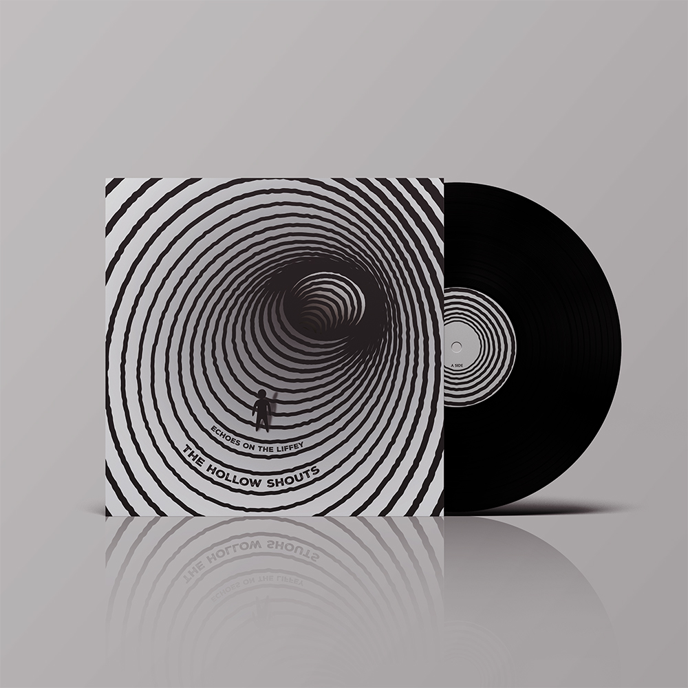
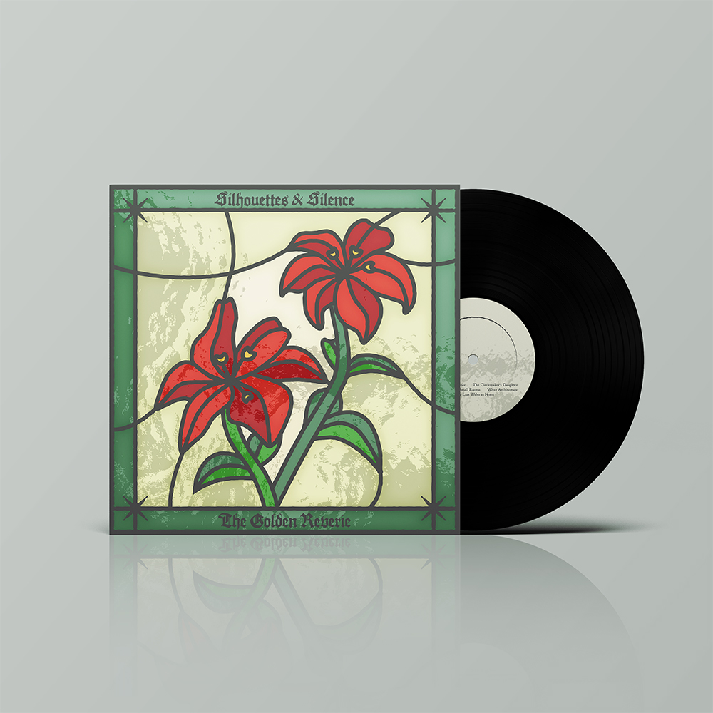
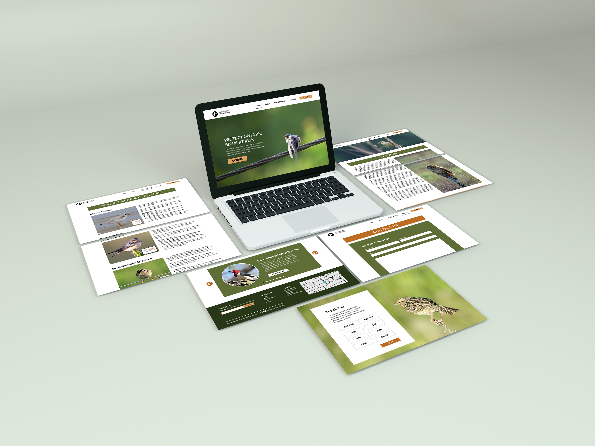
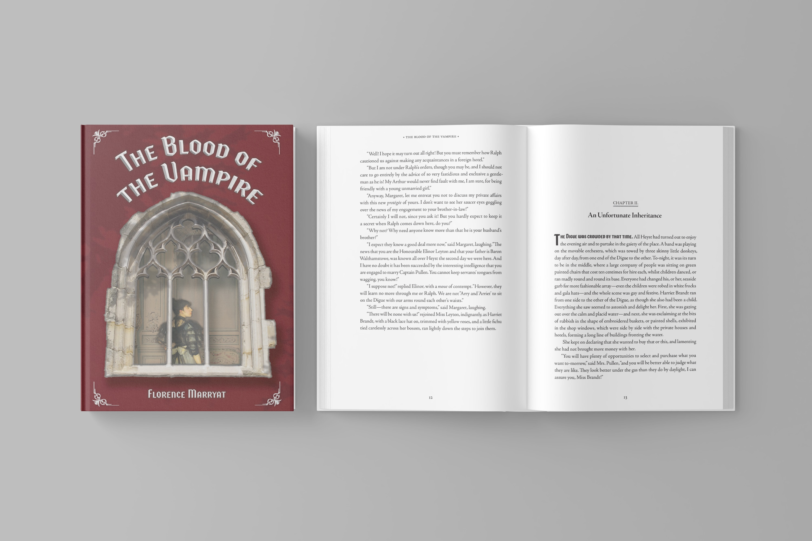

# Sam's Resume
My name is **Samantha Capobianco**, I am currently a graphic design student at Humber Polytechnic. Check out some of my work on [my website](https://readymag.website/u1363359061/4950580/)

## Highlight of Qualifications
- Three years of experience using Adobe Suite in educational and professional settings
- Developed proficiency using Canva software and Sony FX3 during internship with the Faculty of Health Sciences
- Two years of experience operating Nikon DLSR cameras for photography and videography
- Attentive to detail ensuring projects are completed according to requirements
- Strong ability to use time wisely and efficiently through deadline management and strategic planning

## Education
### Humber Polytechnic
Graphic Design

*September 2025 - Present*
#### Design
- Applied core design principles to create visually effective poster compositions and designed two original printed vinyl covers, translating conceptual ideas into print-ready layouts.

- Designed and developed an accessible website for a charity, implementing AODA standards through accessible navigation, typography, and colour contrast

#### Typography
- Applied typographic principles including contrast, hierarchy, and grid systems to design a type specimen poster and an album insert poster, producing print ready layouts with strong composition and attention to detail.
- Designed and printed a multi-page cookbook and a fully typeset book based on a classic from Project Gutenberg, demonstrating proficiency in layout design, long-form typography, and print production.

### McMaster University
Honours Bachelor or Arts, Media Arts

*September 2020 - April 2024*

Senior Thesis Research and Production, Winter 2024
- Developed and executed a plan for a design-based project exploring Ontario Wildflowers that resulted in achieving a final grade of 100%.
- Created a series of seed packets through an iterative process using feedback from an advisor.

Graphic Design, Winter 2023

- Designed a novel in an expressive manner that conveyed a clear concept through the application of design principles and typographic conventions which resulted in the achievement of a final grade of 91%.
Television and Society, Fall 2023
- Coordinated and delegated work to four people for a group presentation to ensure deadlines were met and members were well-practiced which resulted in achieving a grade of 96%.

## Employment Experience
### Communications Assistant
McMaster Health Sciences, Hamilton

*May 2023 - April 2024*
- Created workflow document to ensure brand standardization across community of practice.
- Created graphics and videos for YouTube and Instagram which resulted in increased follower count.
- Facilitated the redesign of YouTube thumbnails and updated videos for AODA compliance.
- Organized archival media into accessible packages for a smooth workflow.

### Bakery Clerk
Sobeys

*July - December 2022*
- Responded to customers in a timely and effective manner, ensuring accurate orders.
- Maintained merchandise supply to ensure availability of products to customers using Sobey’s computerized inventory system.
- Coordinated and decorated displays of desserts and baked goods

